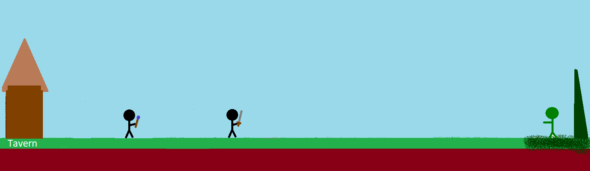

# Defense of the Tavern

#### DotT

### Story

What's better than cracking open a cold one with your best friend after guard duty?

Nothing. right?

So it's a sunny friday afternoon and you and your mate are heading to the local tavern. Suddenly the sky is veiled in a dark green light. Thunderbolt are striking the earth near your favourite bar. After running to the destination you see it, the big green skill emerging from the grounds deepths.

The tavern host screams out of the window he wants you to defend his beloved house from the invaders. His reward is a day of free beer for you and your friend.

You look into your friends eyes drawing your weapons simultaneously and letting a battle cry out of the deepths of our throats.

### Design

### Gameplay

At the start of the game you have to choose between three weapons:

| Weapon     | Damage | Survivability |
| :--------- | :----- | ------------- |
| Sword      | low    | high          |
| Bow        | medium | medium        |
| Mage staff | high   | low           |

When both player have their choosen weapon the game starts. Soon after you spawned in the first wave starts.

